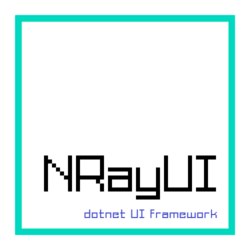
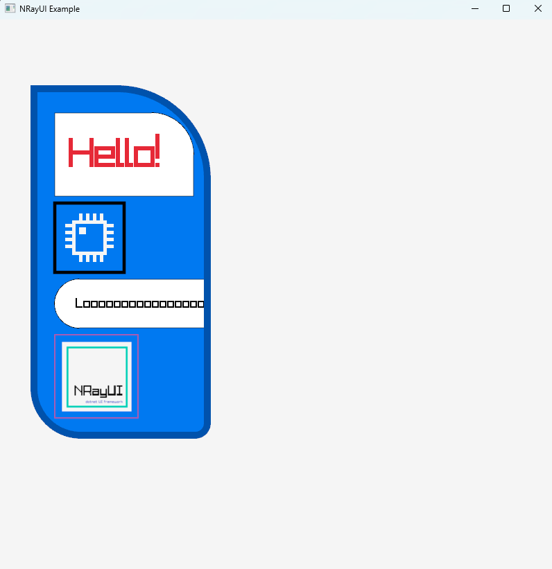

NRayUI [![Status Enfer][status-enfer]][andivionian-status-classifier]
===

---
NRayUI - free library for creating UI for games with declarative style.

Implementation Status
---------------------
Some of the UI features have been implemented

Installation
------------
Download the latest distribution for your platform from [**Nuget**][nuget-url].

For a development build, browse from sources.

## Resources

- 💨 [Getting started](https://github.com/evgTSV/NRayUI/tree/main/docs)

- 📚 [Documentation](https://github.com/evgTSV/NRayUI/tree/main/docs)

- 📓 [Examples](https://github.com/evgTSV/NRayUI/tree/main/NRayUI.Examples)

- 🕹️ [Video demo](https://www.youtube.com/watch?v=trzFjI_Zo4k)

Requirements
------------

* [.NET 10 SDK](https://dotnet.microsoft.com/en-us/download/dotnet/10.0)

Example
-------

Acknowledgments
---------------

Thanks to [Hack Club][hackclub-url] for support

[andivionian-status-classifier]: https://andivionian.fornever.me/v1/#status-enfer-
[status-enfer]: https://img.shields.io/badge/status-enfer-orange.svg
[hackclub-url]: https://hackclub.com
[nuget-url]: https://www.nuget.org/packages/NRayUI
