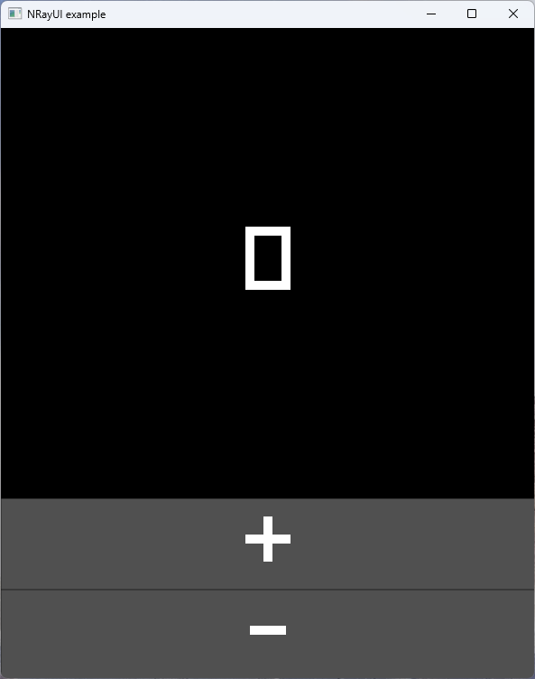

# Getting Started

<div>

<figure><figcaption><p>Screenshot of the example app. (Simple counter app with a text block and two buttons)</p></figcaption></figure>

</div>

## Step 1: Empty Console App

Create a new F# console application targeting .net 10 or higher.

## Step 2: Packages

Reference the following packages [NRayUI](https://www.nuget.org/packages/NRayUI/0.0.1)

Run the following command in your project directory:

```bash
dotnet add package NRayUI --version 0.0.1
```

Paste the following package reference to your fsproject file:

```html
<PackageReference Include="NRayUI" Version="0.0.1" />
```
## Step 3: Add code to `Program.fs`

```fsharp
module CounterApp

open NRayUI
open NRayUI.Elements
open NRayUI.Elements.Buttons
open NRayUI.Elements.Panels
open NRayUI.Window
open NRayUI.UIRendering
open NRayUI.Components.UIConfigurator
open NRayUI.Modifier
open NRayUI.RenderBase
open Raylib_CSharp.Colors

let counterView (ctx: UpdateContext) =
    let state = ctx.UseState(0)
    StackPanel.create [
        BoxSet.backgroundColor Color.Black
        BoxSet.borderWidth 0f
        StackPanelSet.spacing 1f
        PanelSet.children [
            Label.create [
                LayoutSet.modifiers [
                    paddingScan "250"
                ]
                BoxSet.backgroundColor Color.Blank
                TextSet.color Color.White
                TextSet.content (string state.Current)
                TextSet.fontSize 100f
            ]
            Button.create [
                LayoutSet.modifiers [
                    padding { Top = 5f; Bottom = 5f; Left = 250f; Right = 250f }
                ]
                BoxSet.backgroundColor Color.DarkGray
                ButtonSet.onClick (fun() -> state.Set(state.Current + 1))
                TextSet.color Color.White
                TextSet.content "+"
                TextSet.fontSize 100f
            ]
            Button.create [
                LayoutSet.modifiers [
                    padding { Top = 5f; Bottom = 5f; Left = 250f; Right = 250f }
                ]
                BoxSet.backgroundColor Color.DarkGray
                ButtonSet.onClick (fun() -> state.Set(state.Current - 1))
                TextSet.color Color.White
                TextSet.content "-"
                TextSet.fontSize 100f
            ]
        ]
    ]

let builder = UIBuilder()

%builder
    .WithWindow({
        Title = "NRayUI example"
        WindowSizePx = (580, 720)
    })
    
let app = builder.Build()

counterView
|> startRendering app
```

## Step 4: build and run 🎉

```bash
dotnet run
```
